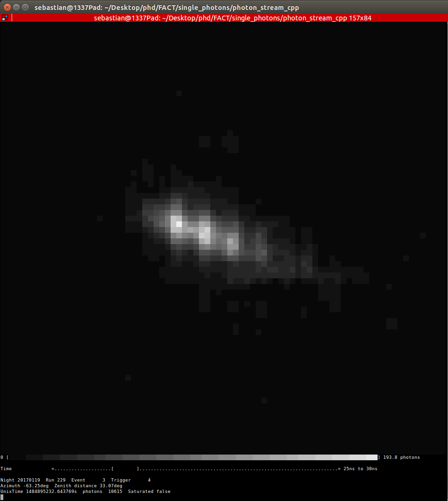
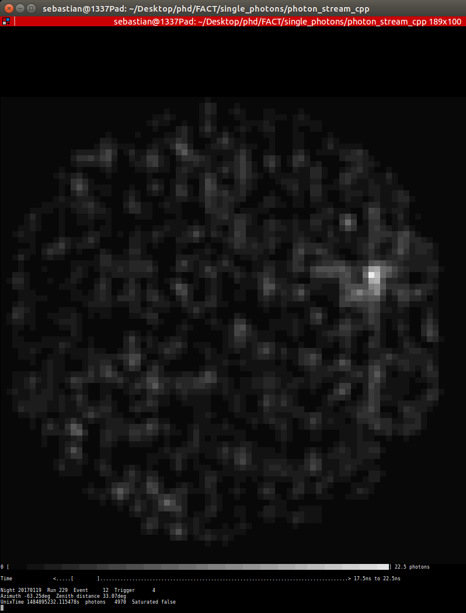

# Photon-Stream for C++

Read about the photon-stream and its file-formats in the [base photon-stream repository](https://github.com/fact-project/photon_stream).

## All you need 
to read and write binary photon-stream files:

```photon_stream.h```

__Only__ C++ ```std``` library.

## Examples
Examples which include ```photon_stream.h```. Take a look into the ```example``` directory.

### ASCII event viewer 
Draws FACT events onto your command line.

Build:
```bash
g++ examples/docopt/docopt.cpp examples/viewer.cpp -o phs.viewer -std=gnu++11
```

1st) Use zcat to ungzip the input file.
```bash
zcat tests/20170119_229_pass4_100events.phs.gz > tests/20170119_229_pass4_100events.phs
```

2nd) Call the phs.viewer and read the help print.
```bash
./phs.viewer -i tests/20170119_229_pass4_100events.phs
```
 


### Table print
Prints a table summary of the events in the input.

Build:
```bash
g++ examples/docopt/docopt.cpp examples/table.cpp -o phs.table -std=gnu++11
```

Call via ```PIPE``` and ```zcat``` to unzip the file.

```bash
zcat tests/20170119_229_pass4_100events.phs.gz | ./phs.table
```
will print:

```
night    run event trigger  Az[deg] ZD[deg]  UnixTime[s]   photons
------------------------------------------------------------------
20170119 229     1      4  -63.25  33.07  1484895232.532244    4984
20170119 229     2      4  -63.25  33.07  1484895232.552913    4857
20170119 229     3      4  -63.25  33.07  1484895232.643769   10615
20170119 229     4      4  -63.25  33.07  1484895232.675652    5221
20170119 229     5      4  -63.25  33.07  1484895232.690576    4661
20170119 229     6      4  -63.25  33.07  1484895232.718719    5692
20170119 229     7      4  -63.25  33.07  1484895232.747059    4850
20170119 229     8   1024  -63.25  33.07  1484895232.845441    4612
20170119 229     9      4  -63.25  33.07  1484895232.895595    5204
20170119 229    10      2  -63.25  33.07  1484895232.002080    4697
```
